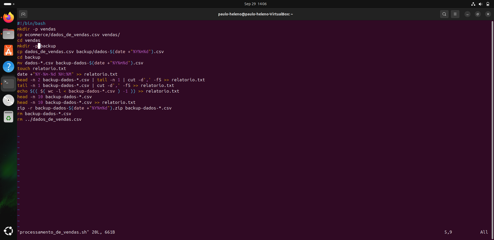
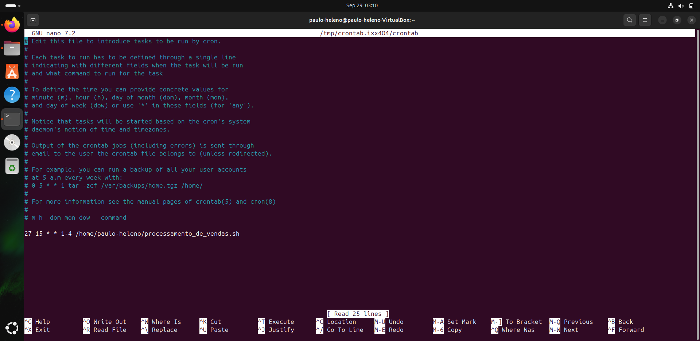
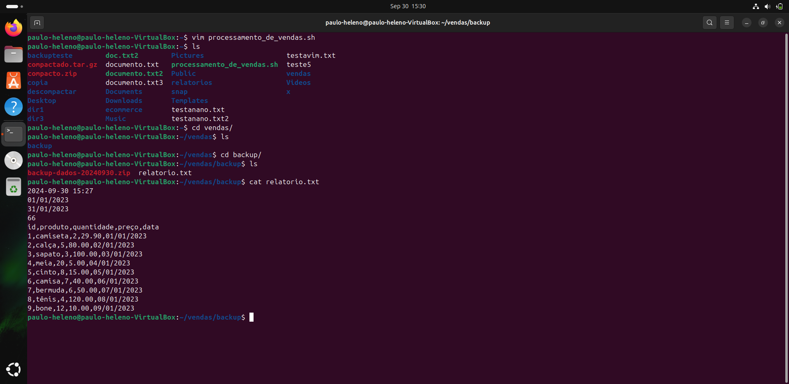
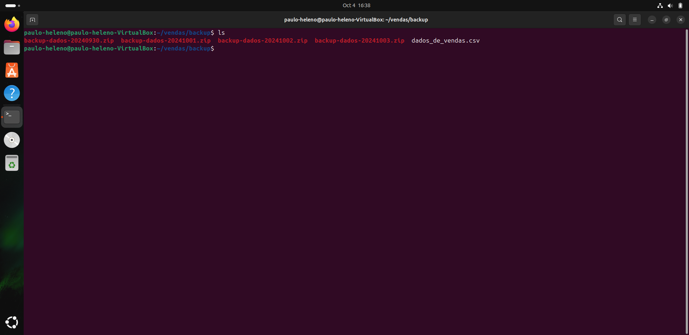
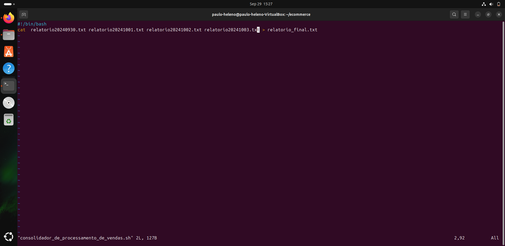
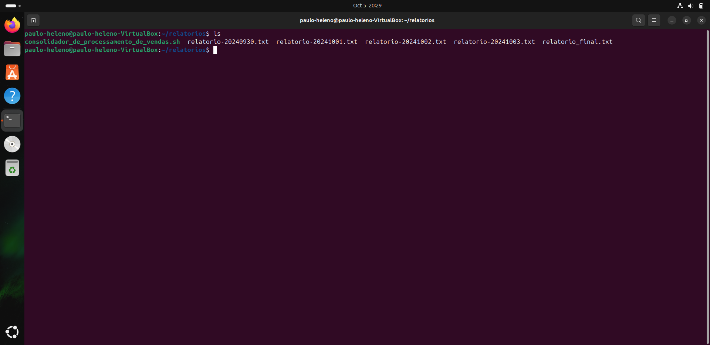

# Exercícios

[Diretorio_exercicios](exercicios/)
- Nenhum nessa sprint

# Evidências

## Usei o comando "vim" para fazer a criação do script processamento_de_vendas.sh
 

## Aqui está o código do meu script executável, tive uma certa dificuldade ao lidar com a criação do corpo do relatorio.txt
 

## Assim ficou o código do meu agendamento para a execução do script, o comando para abrir a interface que eu fiz o agendamento é o "crontab -e"

## Aqui está um exemplo doque foi gerado após o primeiro dia de execução do script, observe que o último comando "cat relatorio.txt" é usado para demonstrar o conteúdo do arquivo gerado

## Aqui estão os arquivos dados_de_vendas após todos os dias de execução do script processamento_de_vendas.sh

## Este é o script que eu ultilizei para fazer a junção dos quatro relatorios.txt em um único relatório, que é o relatorio_final.txt

## Esse é o relatório_final gerado após a execução do script consolidador_de_processamento_de_vendas.sh

# Certificados

[Diretorio_certificados](certificados/)
- Nenhum nessa sprint

# Desafio

[Diretorio_desafio](desafio/)