# Desafio Sprint 10

## 📋 **Descrição do desafio e o meu passo a passo**  
Objetivo: O objetivo é criar um dashboard no AWS QuickSight para visualizar insights dos dados armazenados na camada Refined do data lake, usando o Athena como fonte de dados.

### Inicialmente, comecei criando um DataSet no AWS QuickSight a partir das tabelas que criei no AWS Athena durante a Sprint 9. Meu DataSet ficou composto por duas tabelas: uma tabela fato e uma tabela de dimensão para os filmes.

### Após isso, apliquei um join entre as duas tabelas para unificá-las e permitir o acesso às colunas de ambas.

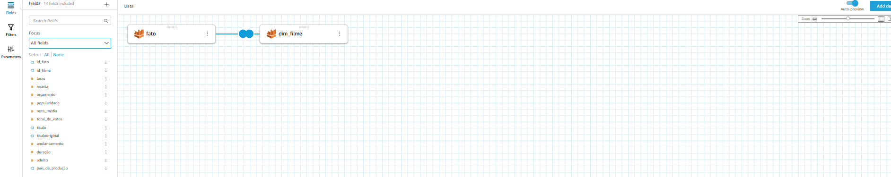

### Depois disso, criei um filtro para poder pegar apenas filmes com o "Ano de lançamento" acima de 2000.

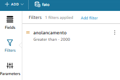

### Abaixo, segue a imagem do DataSet criado no QuickSight:

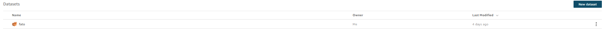

### Em seguida, iniciei uma análise no QuickSight através do meu DataSet para criar meu DashBoard.

### Primeiramente escolhi o título do meu dashboard.

### Logo após, criei 6 KPI (Key Performance Indicator).

### Agora um pouco sobre cada uma:

1. **🎞️ Quantidade de filmes analisados**  
   - Exibe o total de filmes incluídos na análise.

2. **💰 Filme com a maior receita**  
   - Mostra o filme que gerou a maior receita total.

3. **⭐ Filme com a maior nota média**  
   - Exibe o filme com a melhor avaliação média do público.

4. **🗳️ Filme com o maior número de votos**  
   - Destaca o filme com a maior quantidade de avaliações registradas.

5. **⏳ Filme com a maior duração (minutos)**  
   - Indica o filme mais longo da análise.

6. **🌍 País de produção com maior lucro médio**  
   - Revela o país cujos filmes tiveram, em média, o maior lucro.

### Essas são as KPIs:

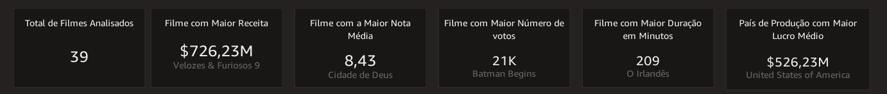

### Por conseguinte, criei 4 gráficos para minha análise.

### O primeiro tem o intuito de comparar orçamento e duração dos filmes para dentificar se filmes com maior orçamento tendem a ser mais longos ou curtos.

### Para ajudar na vizualização desse gráfico, criei uma coluna para classificar os filmes como curto, médio ou longo de acordo com o tempo de cada filme. Logo abaixo, o pequeno trecho de código que foi usado.

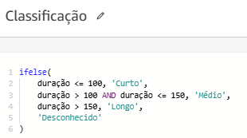

### O gráfico:

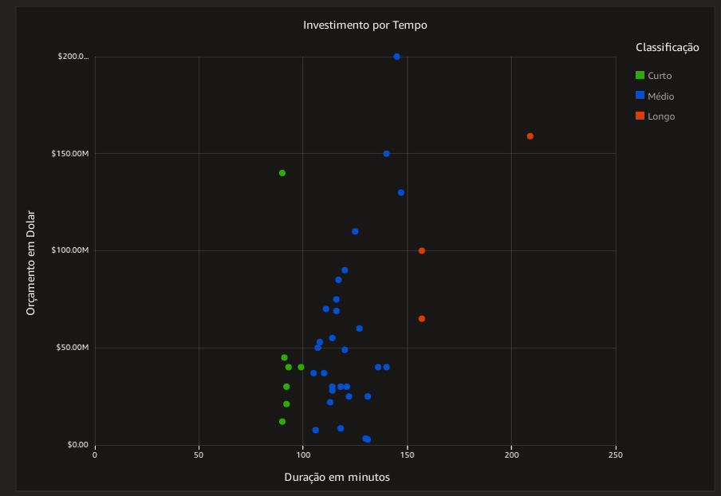

### O segundo tem o intuito de avaliar se filmes com as maiores receitas também são os mais populares.

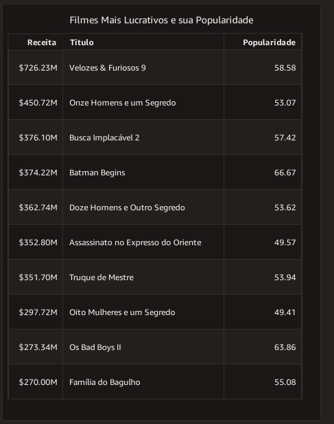

### O terceiro tem o intuito de descobrir se filmes com mais votos são os que têm as melhores notas. Isso pode indicar se um filme amplamente avaliado é geralmente bem recebido pelo público.

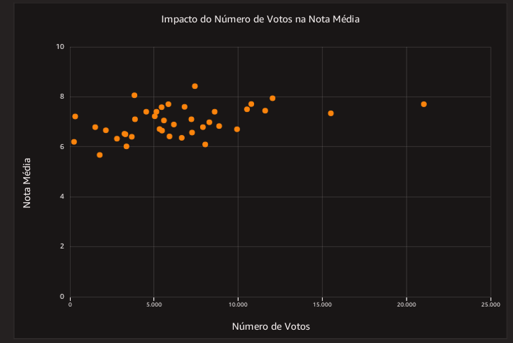

### O quarto tem o intuito de ver quais países produzem os filmes mais lucrativos e se há um padrão geográfico de sucesso. 

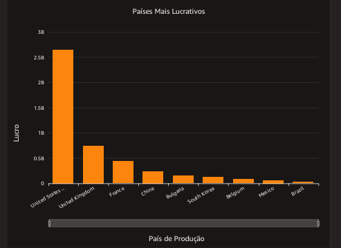

### Por fim, feito tudo isso, esse foi o resultado final do meu DashBoard: 

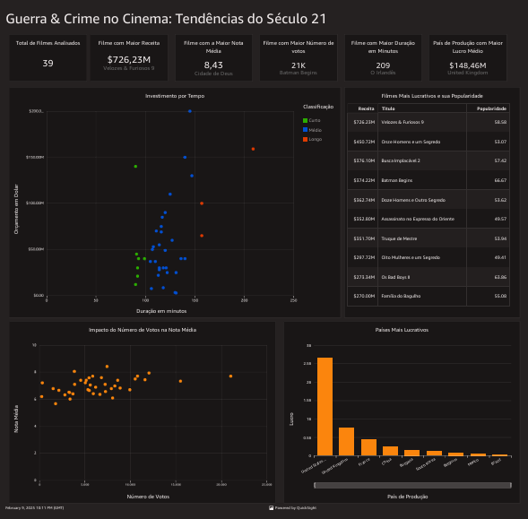

### Ele salvo no QuickSight:

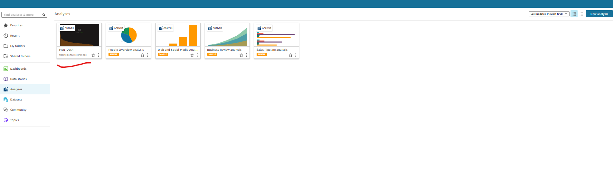
