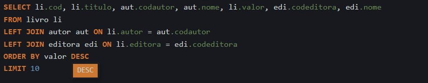
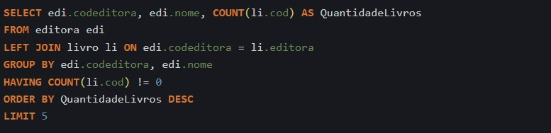
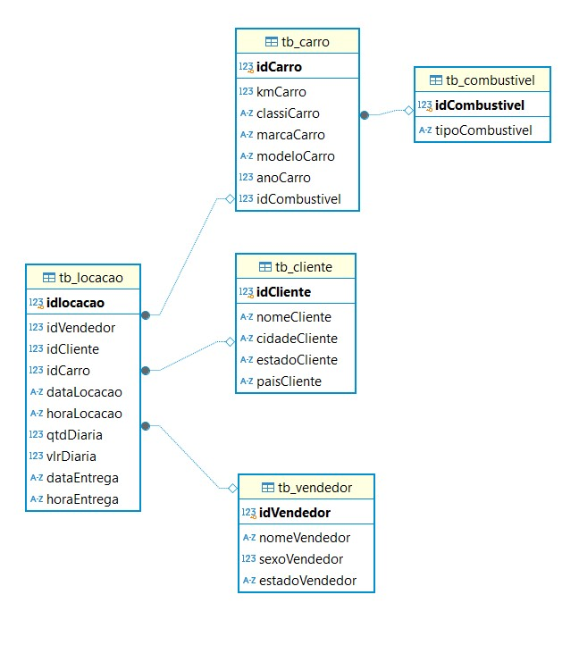
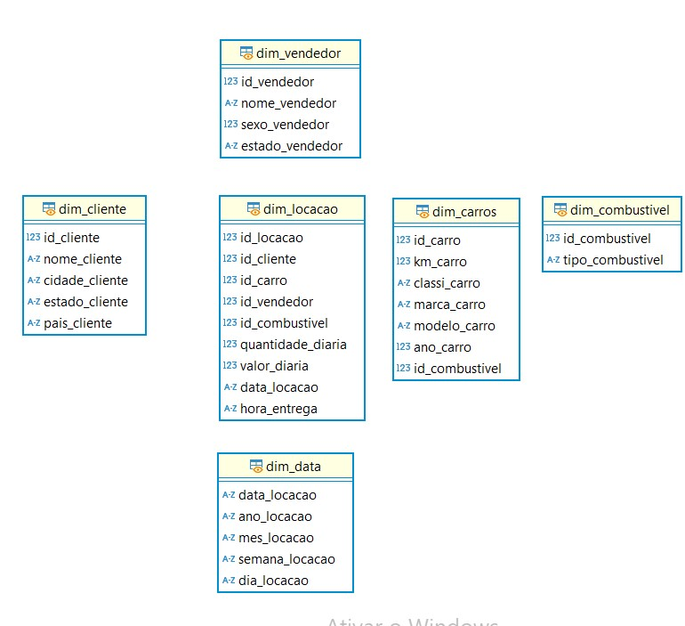

# Exercícios

## 💡 Em geral, os exercícios foram tranquilos. O que contribuiu para isso foi o fato de essa não ser minha primeira experiência com SQL. Embora eu tenha levado um tempo para relembrar como manipular as tabelas corretamente, os exercícios estavam bem elaborados, o que também contribuiu para o bom desempenho.

## Logo abaixo, o caminho para a pasta de exercicios

## [Diretorio_exercicios](exercicios/)

# Evidências

## Segue abaixo o código usado para obter os 10 livros mais caros da biblioteca
 

## Aqui está o código do meu script para obter as editoras com maior quantidade de livros
 

## Segue abaixo, os diagramas que foram gerados através do modelo relacional

## Logo em seguida os diagramas do modelo dimensional

# Certificados

## 💡 Nessa sprint tem apenas o certificado do curso AWS Partner: Sales Accreditation (Business)

## Logo abaixo, o caminho para a pasta de certificados

## [Diretorio_certificados](certificados/)

# Desafio

## Logo abaixo, o caminho para a pasta do desafio

## [Diretorio_desafio](desafio/)