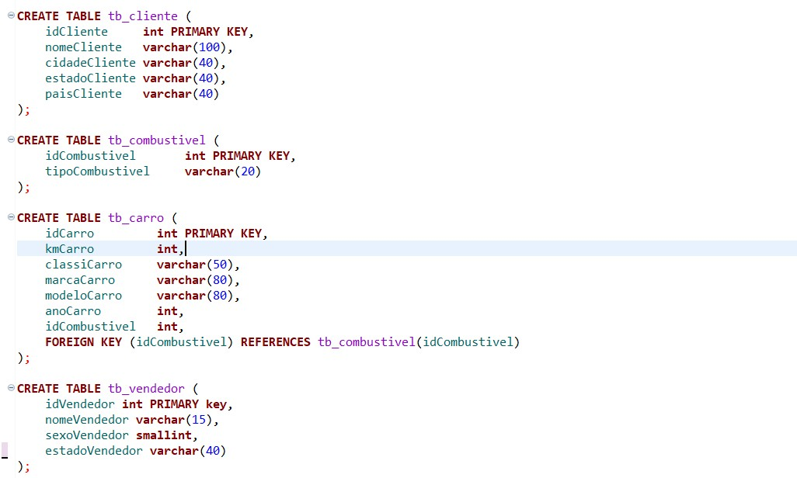
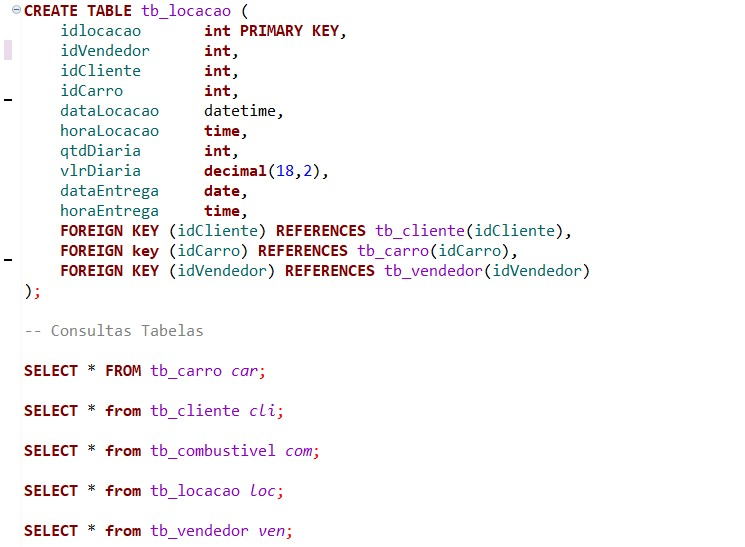
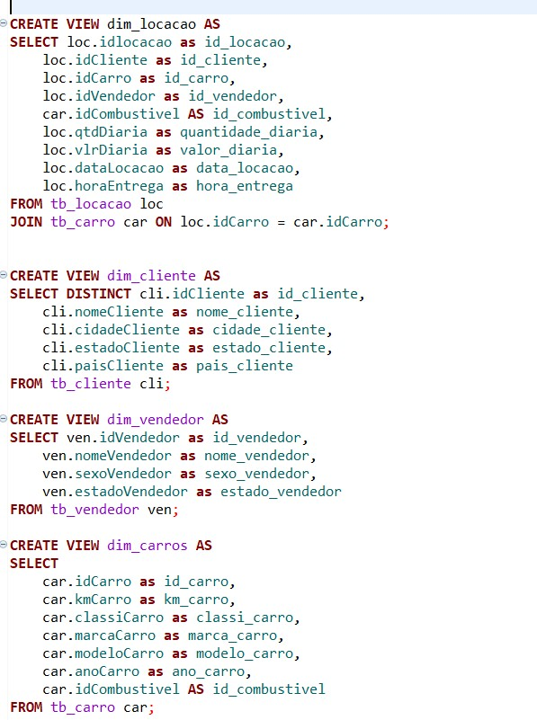
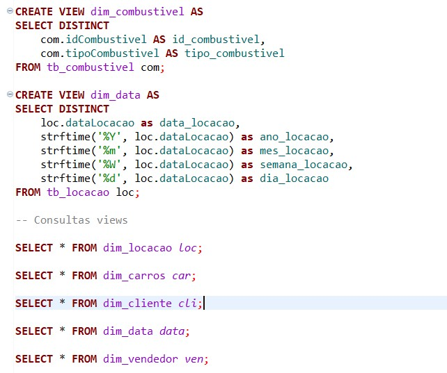

# Desafio Sprint 2

## 📋 **Descrição do desafio e o meu passo a passo**  
Objetivo: prática de conhecimento de modelagem de dados relacional e dimensioonal com linguagem SQL.

### Inicialmente, um arquivo concessionaria.zip é disponibilizado, logo em seguida, esse arquivo deve ser descompactado e aberto em um cliente SQL, eu optei pela utilização do DBeaver, logo abaixo está o conteúdo do arquivo concessionaria.

### Como podem ver, o arquivo acima esta desnormalizado, dito isso, o desafio consiste em normalizar esta base de dados, ou seja, aplicar as formas normais e depois converter o modelo relacional em modelo dimensional e elaborar um desenho explicativo dos dois modelos.

### Para fazer a normalização, primeiro eu analisei cada elemento contido na tabela desnormalizada, em seguida eu comecei a pensar em como estruturar esses elementos em outras tabelas.

### Após a analise dos elementos, eu cheguei a conclusão de organizar os dados da seguinte maneira:
    - Tabela_cliente: idCliente, nomeCliente, cidadeCliente, estadoCliente, paisCliente
    - Tabela_combustivel: idCombustivel, tipoCombustivel
    - Tabela_carro: idCarro, kmCarro, classiCarro, marcaCarro, modeloCarro, anoCarro, idCombustivel
    - Tabela_vendedor: idVendedor, nomeVendedor, sexoVendedor, estadoVendedor
    - Tabela_locacao: idLocacao, idVendedor, idCliente, idCarro, datalocacao, horaLocacao, qtdDiaria, vlrDiaria, dataEntrega, horaEntrega

### Além dos atributos, também foram feitos alguns relacionamentos através de chaves estrangeiras, cada chave estrangeira renferencía uma tabela para fazer a relação entre as tabelas, esses relacionamentos são:
    - Tabela_locacao: essa tabela se relaciona com tabela_vendedor, tabela_Cliente e tabela_carro
    - Tabela_carro: essa tabela se relaciona com tabela_combustivel e tebela_locacao
    - Tabela_vendedor: essa tabela se relaciona com tabela_locacao
    - Tabela_nome: essa tabela se relaciona com tebela_locacao
    - Tabela_combustivel: essa tabela se relaciona com tabela_carro

### Logo abaixo, estão alguns prints desse passo a passo que fiz na criação desse modelo relacional.

### 💡 Obs: logo abaixo a criação da tabela locacao tem alguns SELECTS que foram criados para conferir os conteudos das tabelas finalizadas.

### A próxima imagem retrata o desenho gerado a partir dos comandos executados anteriormente.

### Por conseguinte, deve ser criado um modelo dimensional a partir desse modelo relacional.

### Conforme foi dito no video do desafio, eu criei uma VIEW(dimensão) para cada tabela existente no meu modelo relacional.

### Além disso, eu também inseri uma nova dimensão expecificamente para datas, essa dimensão se chama dim_data e ela serve para detalhar ainda mais a data_locacao que está na tabela_locacao.

### Logo abaixo estão algumas evidências desse meu passo a passo para criação do modelo dimensional.

### 💡 Obs: Mais uma vez eu criei SELECTS para conferir o conteúdo das dimensões/views

### A seguir, o diagrama do modelo dimensional que foi gerado

### Após isso, o desafio foi finalizado

