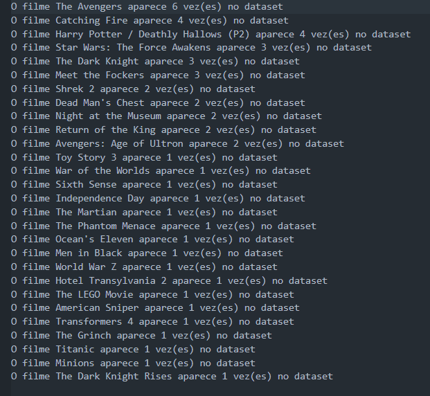
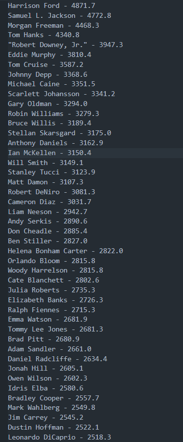
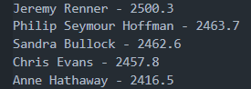

# Exercícios

## 💡 No geral, os exercícios foram tranquilos, com exceção das etapas do exercício 2 de Python com ETL. Ainda assim, consegui aprimorar meus conhecimentos e resolver todos.

## Logo abaixo, o caminho para a pasta de exercicios

## [Diretorio_exercicios](exercicios/)

# Evidências

## Segue abaixo o print da solução de cada etapa do exercicio 2 do etl com python

## etapa 1
 

## etapa 2
 

## etapa 3
 

## etapa 4
 

## etapa 5
 

 

# Certificados

## 💡 Nessa sprint tem apenas o certificado do curso AWS cloud economics

## Logo abaixo, o caminho para a pasta de certificados

## [Diretorio_certificados](certificados/)

# Desafio

## Logo abaixo, o caminho para a pasta do desafio

## [Diretorio_desafio](desafio/)