# Desafio Sprint 3

## 📋 **Descrição do desafio e o meu passo a passo**  
Objetivo: é a prática de python combinando conhecimentos adquiridos.

### Inicialmente, um arquivo googleplaystore.csv é disponibilizado, logo em seguida, o ambiente com jupyter deve ser preparado.

### Em seguida, devemos fazer a instalação das bibliotecas Pandas e Matplotlib, eu instalei ambas e importei elas no arquivo

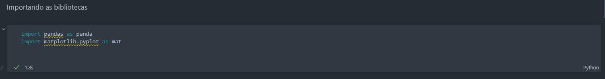

### Depois disso, o desafio pede que o arquivo googleplaystore.csv seja lido e as linhas duplicadas sejam excluidas.

### Logo em seguida o desafio pede que façamos um gráfico de barras contendo os top 5 apps por número de instalação.

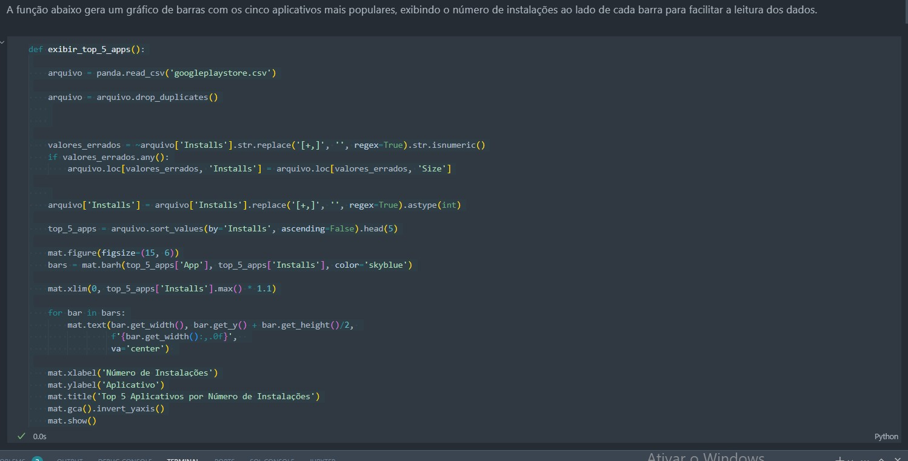

### O grafico gerado

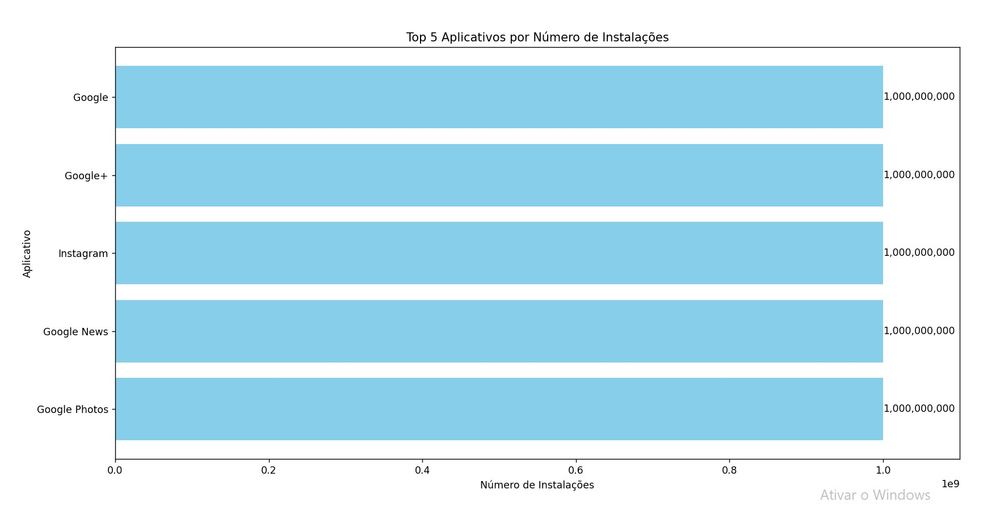

### Depois disso, pede um grafico pizza mostrando as categorias de apps existentes no dataset de acordo com a frequência em que elas aparecem.

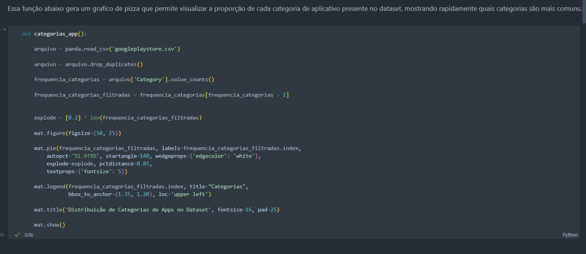

### O grafico gerado

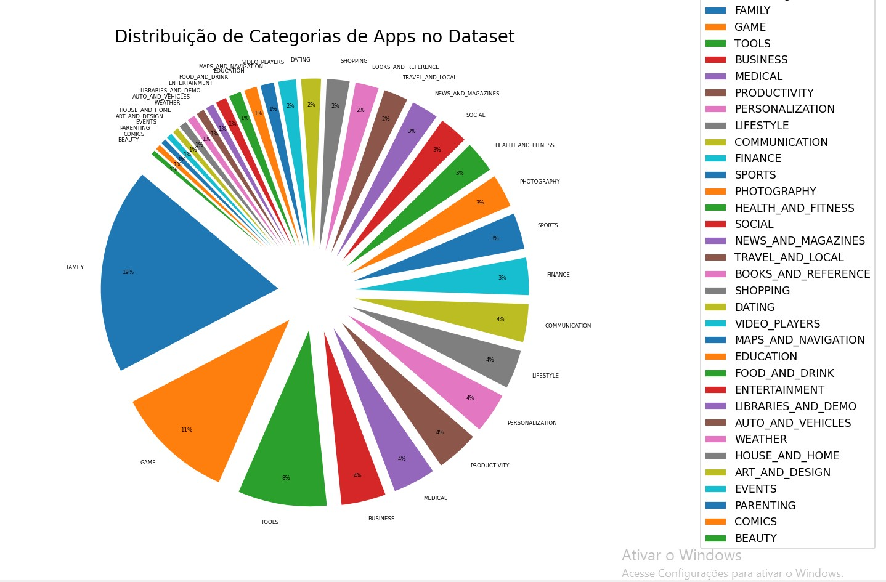

### Logo em seguida, temos que mostrar qual o app mais caro existente no dataset.

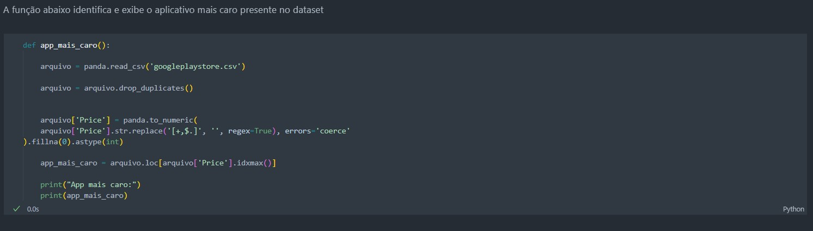

### O resultado gerado

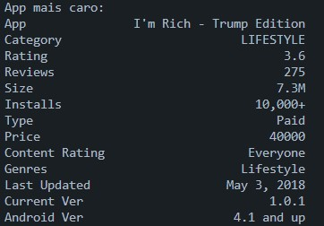

### Além disso, mostrar quantos apps são classificados como 'Mature 17+'

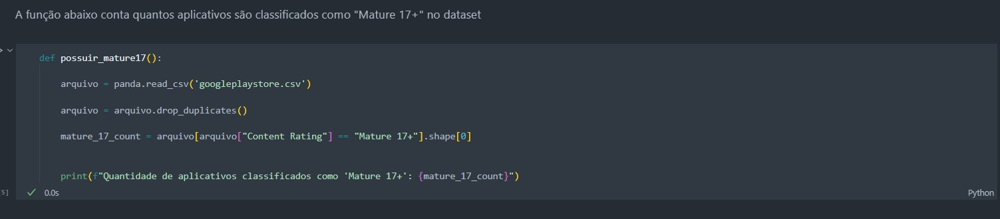

### Resultado gerado

### Mostrar o top 10 apps por números de reviews de forma descrescente

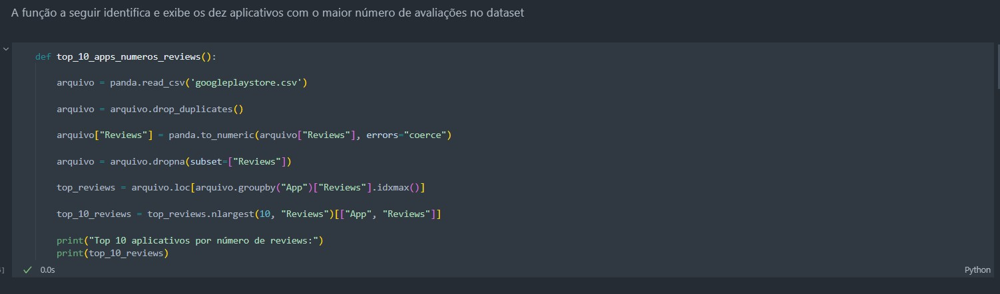

### resultado

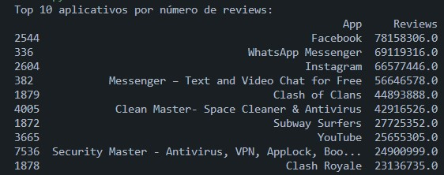

### Criar dois calculos e apresentar um em formato de lista e outro em formato de valor

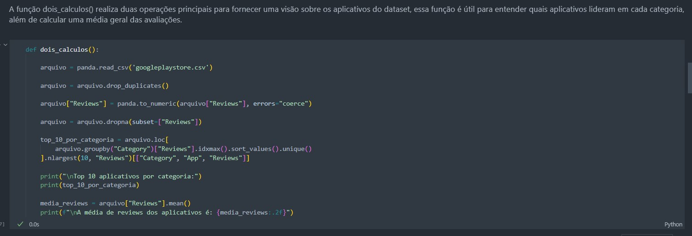

### resultado lista

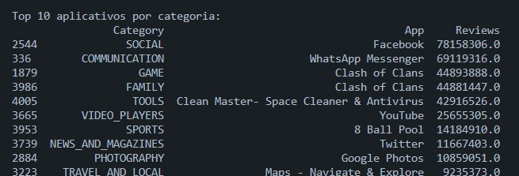

### resultado valor

### Criar duas formas gráficas de exibição dos calculos acima utilizando python e matplotlib

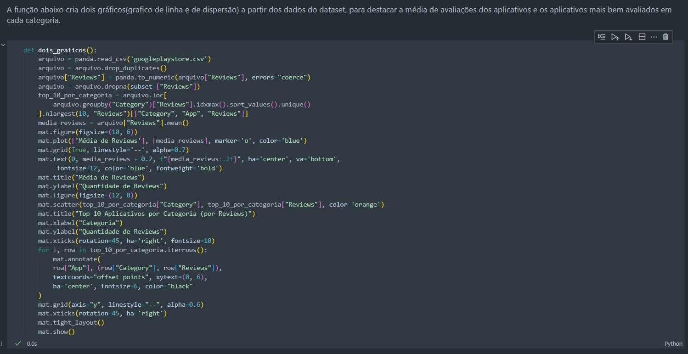

### Resultado gráfico dispersão

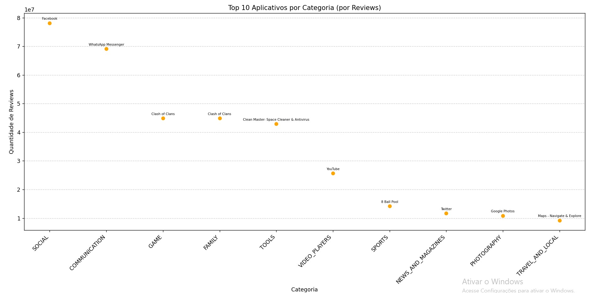

### Resultado gráfico linha

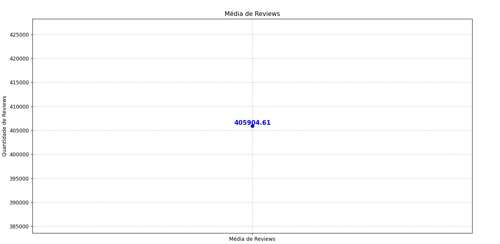

### Executando as funções

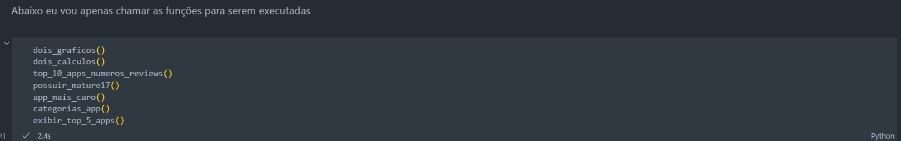

