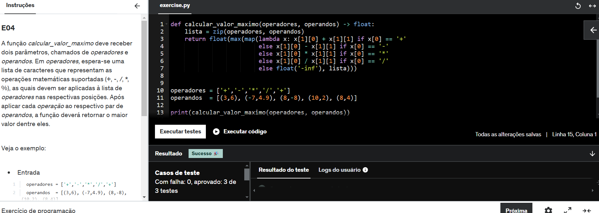
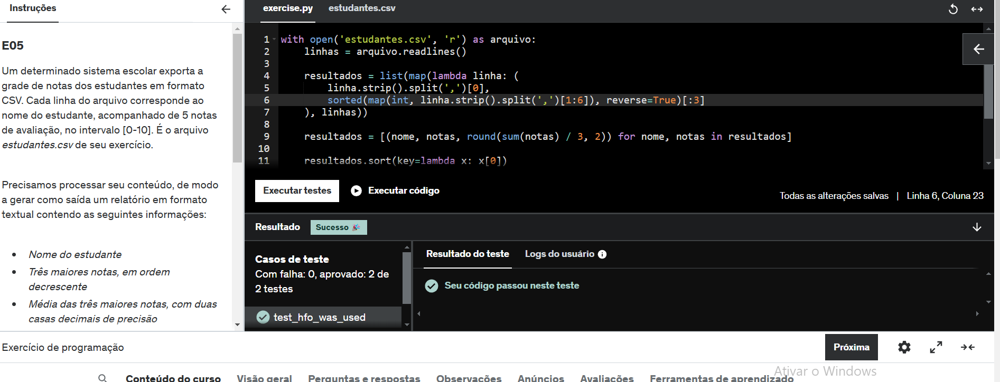
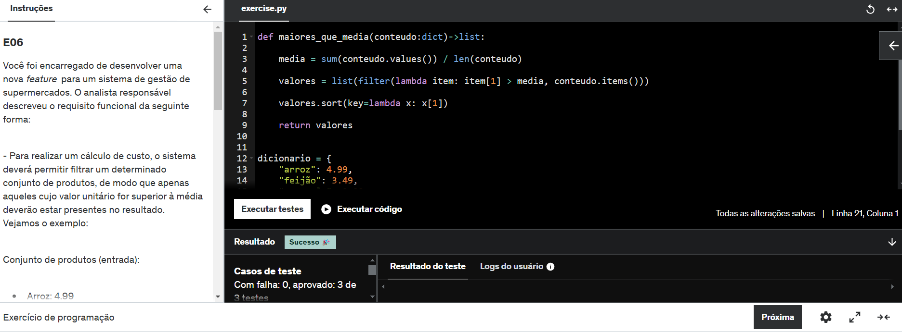

# Exercícios

## No geral, os exercícios foram tranquilos e empolgantes. Tenho uma certa afinidade por programação funcional, e, de modo geral, os exercícios foram bastante satisfatórios.

## Logo abaixo, o caminho para a pasta de exercicios

## [Diretorio_exercicios](exercicios/)

# Evidências

## Segue abaixo o print da solução de alguns exercicios da sprint

## exercicio 4
 

## exercicio 5
 

## exercicio 6
 

# Certificados

## 💡 Nessa sprint tem os certificados do curso AWS Accreditation (Technical) e AWS Technical Essentials

## Logo abaixo, o caminho para a pasta de certificados

## [Diretorio_certificados](certificados/)

# Desafio

## Logo abaixo, o caminho para a pasta do desafio

## [Diretorio_desafio](desafio/)