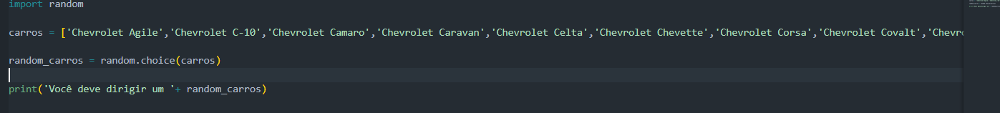
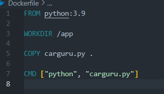
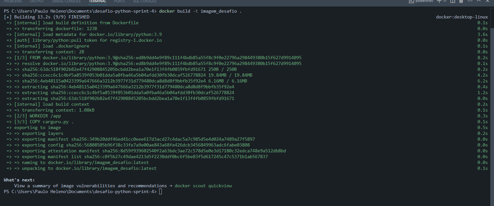
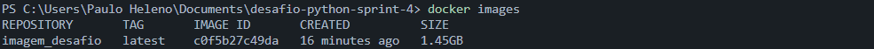
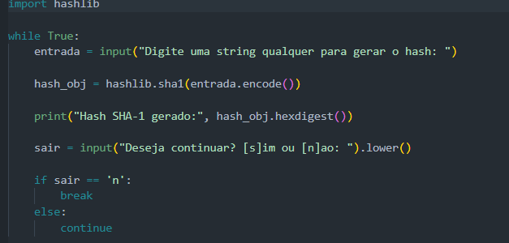
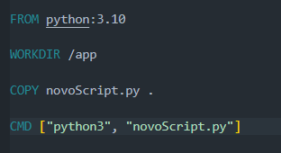
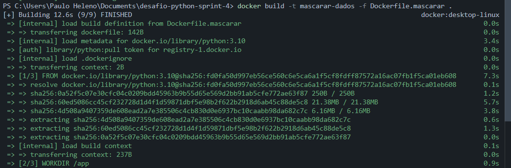
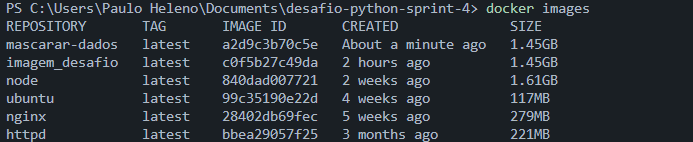
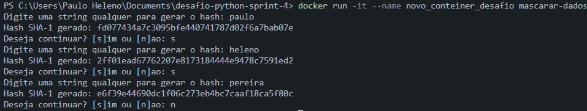

# Desafio Sprint 4

## 📋 **Descrição do desafio e o meu passo a passo**  
Objetivo: prática de python com containers docker combinando conhecimentos adquiridos no PB

### Inicialmente, um arquivo carguru.py é disponibilizado, logo em seguida, devemos garantir que o ambiente para solução com containers esteja preparado.

### O desafio foi dividido em três etapas.

### Na etapa 1 deve ser criada uma imagem a partir de um arquivo de instruções Dockerfile que execute o código carguru.py. Após isso, devemos executar um container a partir da imagem criada.

### Logo abaixo o arquivo.py que foi disponibilizado

### A seguir, o arquivo dockerfile que criei

### Tendo feito isso, usei o seguinte comando para a criação da imagem, decidi chamar a imagem de "imagem_desafio"

### Conferindo se a imagem foi criada

### Logo em seguida, executei um conteiner a partir dessa imagem que criei, decidi chamar o conteiner de "conteiner_desafio"

### A etapa 2 pergunta o seguinte: "É possivel reutilizar containers?"

### Sim, é possivel reutilizar containers que já foram executados, utilizando o comando "docker start conteiner_desafio"

### Eu utilizei a flag '-i' apenas para que fique claro a execução do container podendo conferir a saida

### Logo abaixo, o print da minha utilização do comando no desafio

### A etapa 3 é dividida em partes

### Parte 1 pede para criar novo script Python que implementa o algoritmo a seguir
    - Receber uma string via input
    - Gerar o hash da string por meio do algoritmo SHA-1
    - Imprimir o hash em tela, utilizando o método hexdigest

### O script que criei logo a seguir

### Parte 2 pede para criar uma imagem Docker chamada mascarar-dados que execute o script Python criado anteriormente

### Primeiro eu criei um novo dockerfile chamado "dockerfile.mascarar"

### Depois eu crio a nova imagem chamando ela de "mascarar-dados"

### Conferindo a criação da imagem

### Parte 3 fala que deve ser iniciado um container a partir da imagem e enviar algumas palavras para mascaramento

### comando para iniciar o conteiner logo abaixo, decidi chamalo de "Novo_conteiner_desafio", como podem ver, o conteiner faz os mascaramentos das palavras corretamente, para sair do looping, basta digitar 'n'

