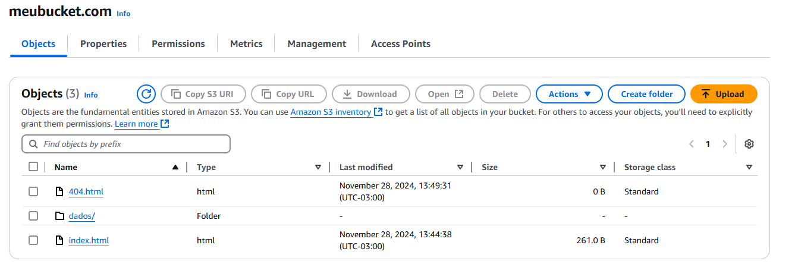
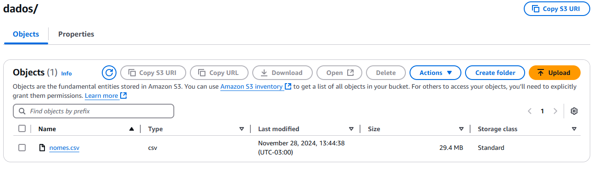
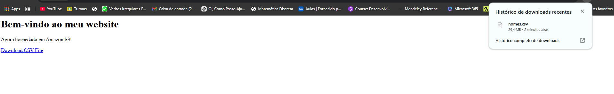

# Exercícios

## No geral, o exercício foi tranquilo. Consegui criar o bucket e realizar o upload de alguns arquivos com sucesso. As etapas do exercício estavam bem definidas, o que tornou a execução mais organizada e eficiente.

## Logo abaixo, o caminho para a pasta de exercicios

## [Diretorio_exercicios](exercicios/)

# Evidências

## Segue abaixo o print de algumas partes do exercicio

## arquivos presentes no bucket
 

## acessando o endpoint e baixando o arquivo nomes.csv

# Certificados

## 💡 Nessa sprint tem os certificados do curso exam prep Standard course e AWS Cloud Quest

## Logo abaixo, o caminho para a pasta de certificados

## [Diretorio_certificados](certificados/)

# Desafio

## Logo abaixo, o caminho para a pasta do desafio

## [Diretorio_desafio](desafio/)