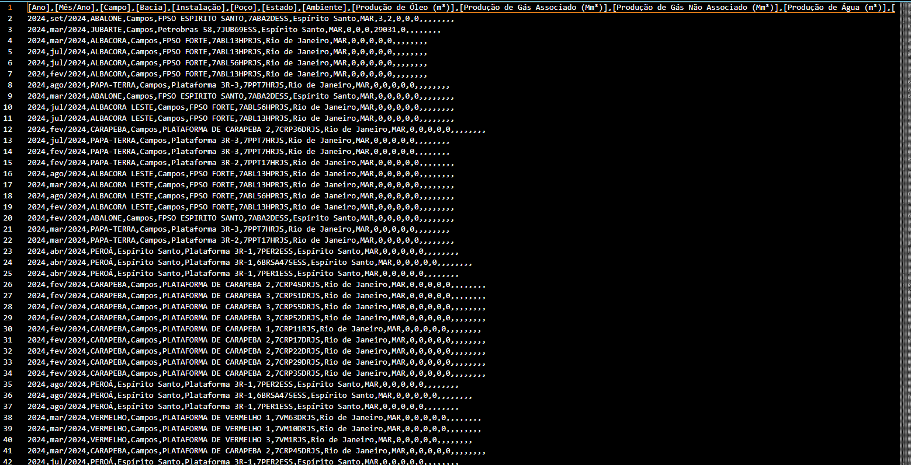
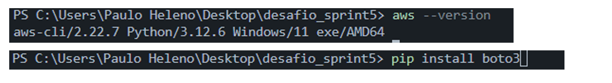
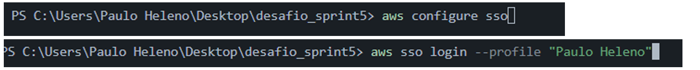
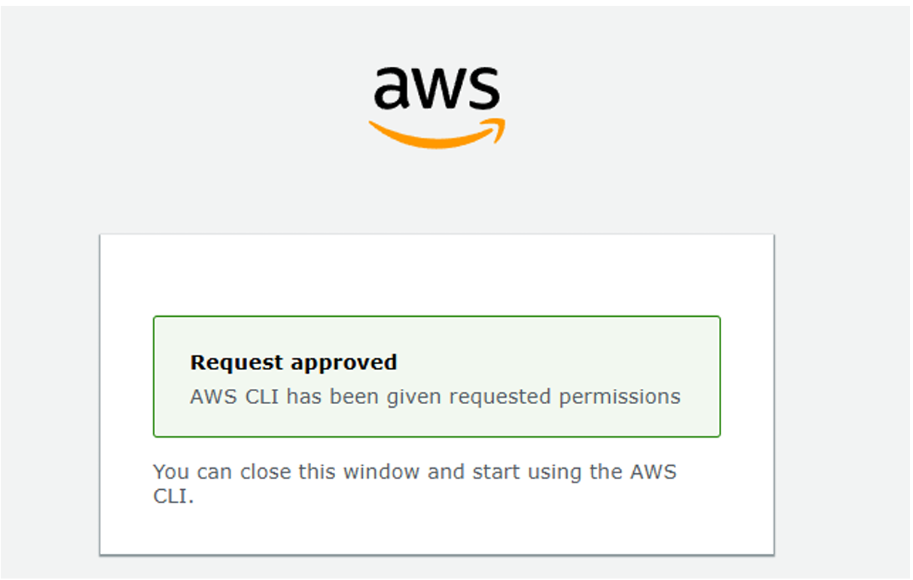
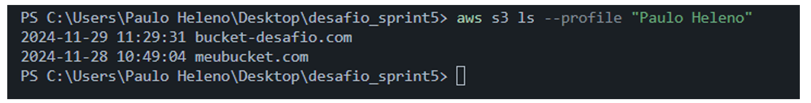
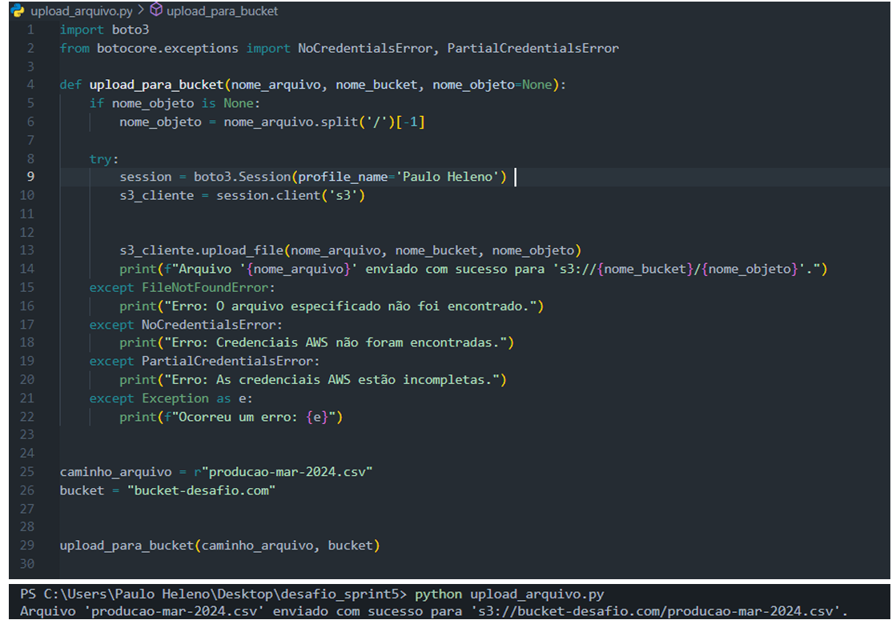
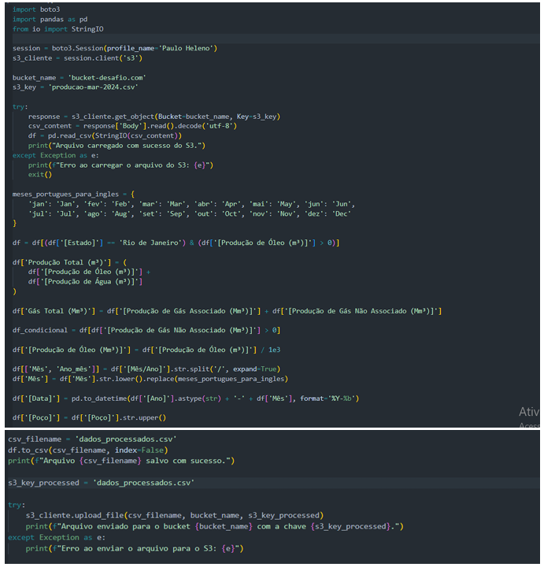
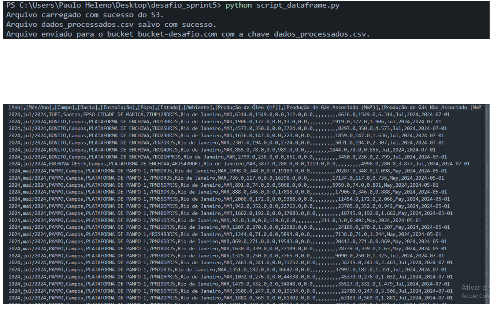
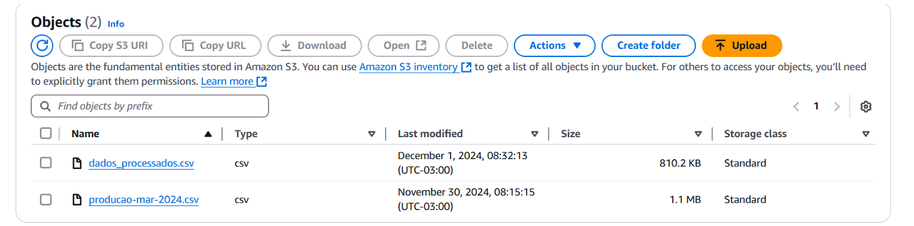

# Desafio Sprint 5

## 📋 **Descrição do desafio e o meu passo a passo**  
Objetivo: praticar os conhecimentos de AWS aprendidos na sprint.

## Inicialmente escolhi um arquivo.csv chamado "producao-mar-2024.csv" no portal de dados publicos do Governo brasileiro

## Depois disso, criei um bucket no s3 chamado "bucket-desafio.com"

## Em seguida, baixei o aws cli e o boto3

## Após isso, criei um profile chamado "Paulo Heleno" com aws consigure sso e loguei na minha conta aws console através dele

## Requisição foi aceita

## Para confirar se tudo estava certo, utilizei o seguinte comando abaixo. O comando serve para listar os buckets que estão no meu s3

## Por conseguinte, criei um script chamado "upload_arquivo.py", a função desse script é subir o "producao-mar-2024.csv" pro nosso bucket. Após a criação ele foi executado, coloquei alguns prints para facilitar a visualização

## Logo em seguida, criei um outro script chamado "script_dataframe.py" que tem como objetivo baixar o arquivo csv do bucket, gerar um dataframe e um arquivo.csv chamado "dados_processados" a partir do dataframe. O dataframe tem os seguintes requisitos:
## OBS: todas as funções abaixo retornam somente uma resposta

    - uma clausula que filtra dados usando ao menos dois operadores lógicos
    - duas funções de agregação
    - uma função condicional
    - uma função de conversão
    - uma função de data
    - uma função de string

## Execução do script e o arquivo "dados_processados" que foi gerado a partir dele, coloquei prints para facilitar a visualização

## Arquivos no bucket ao final do desafio

