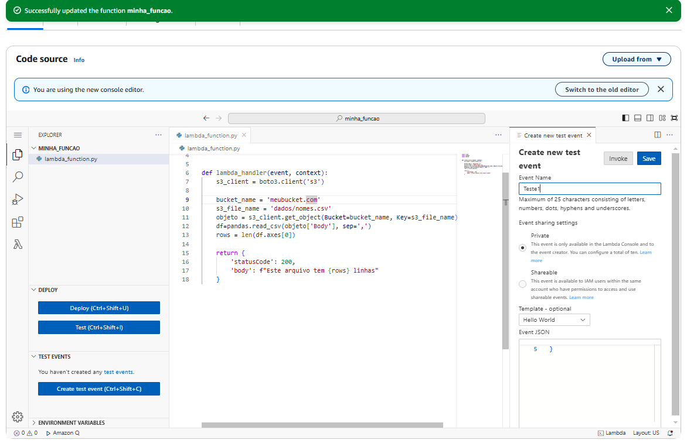

# Exercícios

## No geral, os exercícios foram tranquilos. Pude praticar o AWS Lambda e o AWS Athena, duas ferramentas extremamente importantes para o processamento de dados e análise em nuvem.
## Logo abaixo, o caminho para a pasta de exercicios

## [Diretorio_exercicios](exercicios/)

# Evidências

## Segue abaixo prints dos exercicios

## Exercicio athena
 
### Código para criação da tabela

### Query usada para fazer a consulta que lista os 3 nomes mais usados em cada década desde o 1950 até hoje.

### Resultado da consulta

## Exercicio Lambda

### Código da minha função lambda

### Minha configuração para a memória e o tempo de execução serem suficientes para a realização do teste

### A response que foi retornada

# Certificados

## Logo abaixo, o caminho para a pasta de certificados

## [Diretorio_certificados](certificados/)

# Desafio

## Logo abaixo, o caminho para a pasta do desafio

## [Diretorio_desafio](desafio/)