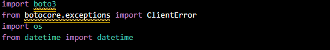
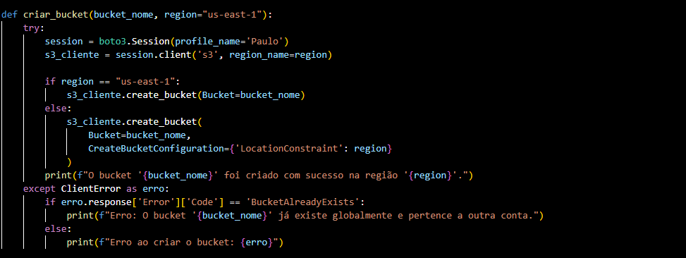
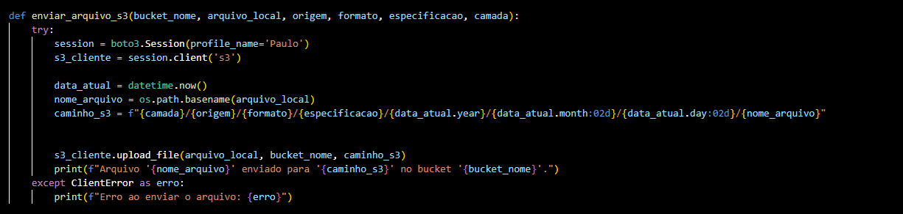
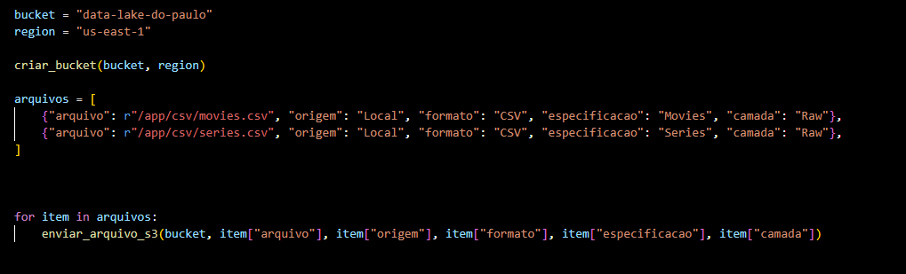
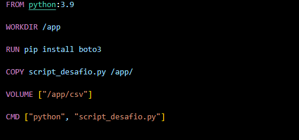
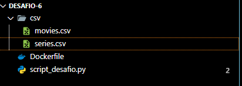
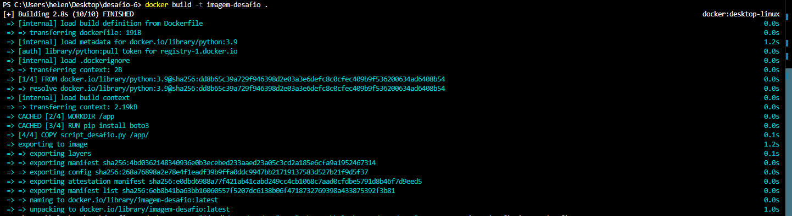
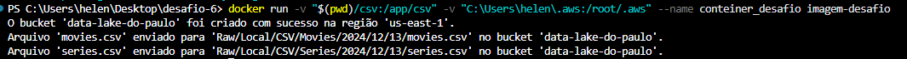
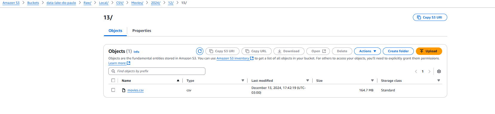
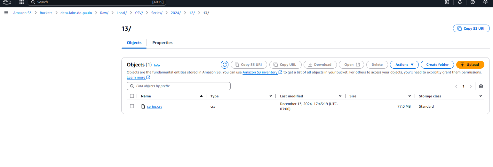

# Desafio Sprint 6

## 📋 **Descrição do desafio e o meu passo a passo**  
Objetivo: ingestão dos arquivos CSV em Bucket Amazon S3 RAW Zone.

## Antes de iniciar o desafio, explorei os dados existentes nos arquivos CSV e defini as questões que os dados devem responder

## E cheguei nessas perguntas para os meus dados:

    - Quais são os 10 filmes mais bem avaliados no TMDB e no IMDb dentro categoria crime?
    - Quais são os filmes mais populares que possuem uma discrepância significativa entre a avaliação do TMDB e IMDb?
    - Filmes de diretores de certas nacionalidades têm avaliações mais altas ou mais baixas no TMDB e IMDb?
    - Quais os 5 filmes mais bem avaliados em um ano x?

## Depois disso, fui para o desafio

## O ponto principal do desafio consiste em criar um código python que será executado dentro de um conteiner docker para carregar os dados locais dos arquivos disponibilizados para a nuvem.

## Os arquivos disponibilizados foram os movies.csv e o series.csv

## Primeiro de tudo, eu construi o script python

### Esses foram os imports que usei no arquivo

### Meu script tem duas funções dentro dele

### A primeira consiste em criar um bucket para que possamos fazer upload de arquivos nele

### Minha função de criação do bucket

### Minha segunda função acessa os arquivos que vão estar no volume de um container e faz upload para um bucket

### Minha função de upload de arquivos

### O restante do script consiste em fornecer informações como nome do bucket, caminho dos arquivos e etc. Além é claro, de chamar as funções com os atributos necessários

## Agora o arquivo Dockerfile que criei

### Ele basicamente executa o script python que criei anteriormente e possui um volume para armazenar os arquivos csv 

### Estrutura do meu arquivo

## Após finalizar essas etapas, minha estrutura de pastas e arquivos ficou assim

## Com tudo isso feito, eu criei a imagem a partir do meu dockerfile com esse comando:

## Depois disso, executei um conteiner a partir dessa imagem montando dois volumes locais

## O primeiro volume permite que arquivos da pasta csv estejam acessíveis no container.

## O segundo volume permite que o conteiner acesse as credenciais AWS configuradas na minha máquina para se conectar com serviços AWS.

## Desse jeito, nenhuma norma de segurança foi infringida.

## Esse foi o comando utilizado. Obs: coloquei alguns prints na saida do script para facilitar a visualização

## Após a execução do comando, essa foi a forma que os arquivos ficaram armazenados no bucket, seguindo o caminho que foi exigido no desafio

### Movies.csv

### Series.csv

