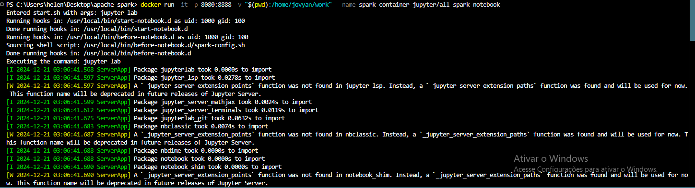
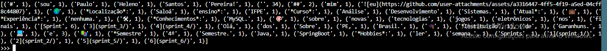
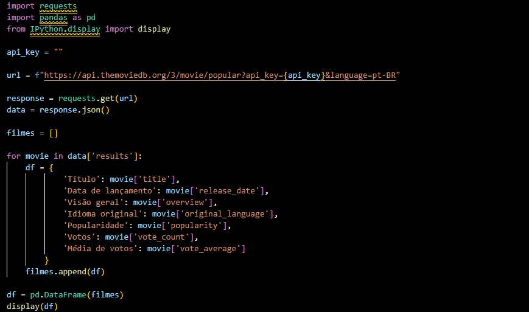
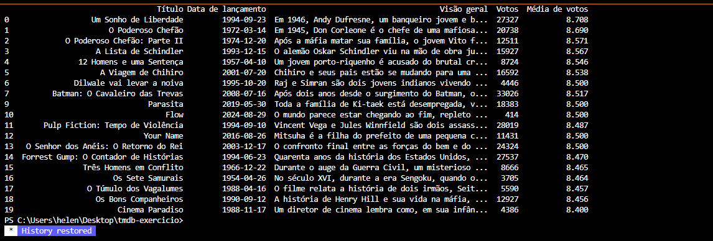
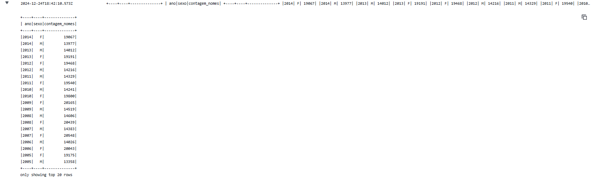
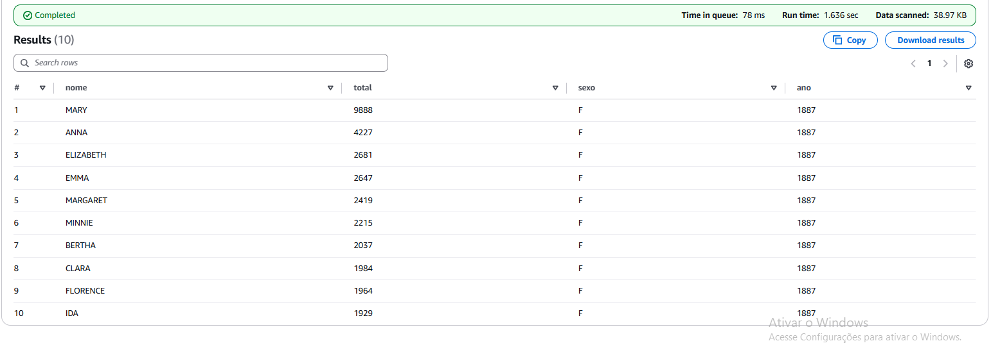
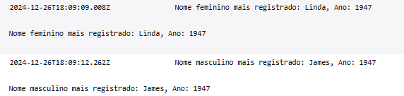

# Exercícios

## No geral, os exercícios foram um pouco complicados dessa vez, mas consegui resolver todos. Pude praticar o AWS Glue, apache spark e conhecer mais sobre o tmdb.

## Logo abaixo, o caminho para a pasta de exercicios

## [Diretorio_exercicios](exercicios/)

# Evidências

## Segue abaixo prints dos exercicios

## Exercicio apache spark
 
### Comando usado para rodar o conteiner

### comando usado no pyspark para contar as palavras do README

### Resultado do comando de contar palavras

## Exercicio tmdb

### Meu código para buscar os filmes mais populares no tmdb

### Esse foi o resultado gerado a partir do script

## Exercicio aws Glue

### Contagem nomes por ano

### Nomes maiusculos

### Nome feminino e masculino mais registrados

# Certificados

## Logo abaixo, o caminho para a pasta de certificados

## [Diretorio_certificados](certificados/)

# Desafio

## Logo abaixo, o caminho para a pasta do desafio

## [Diretorio_desafio](desafio/)