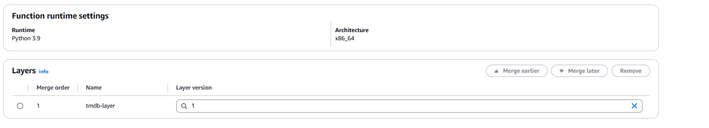
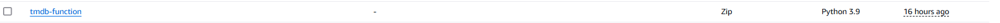
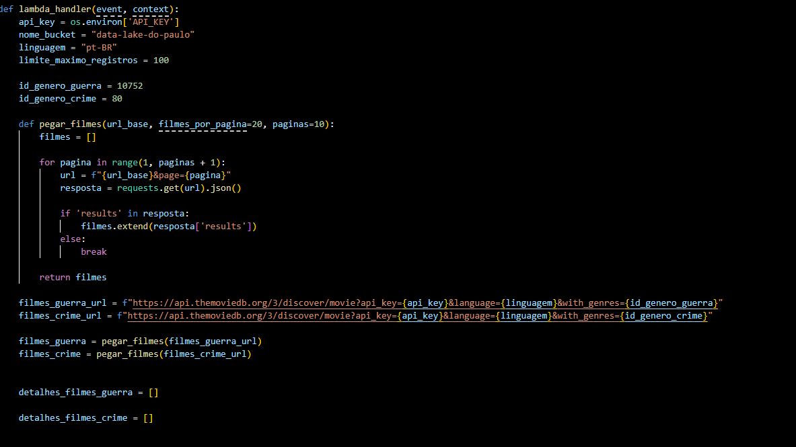
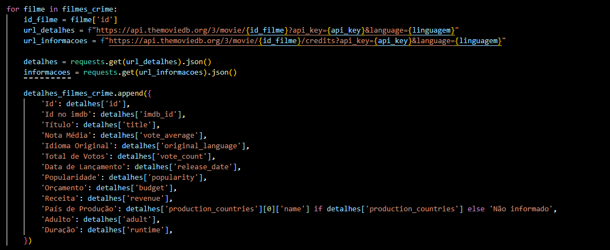
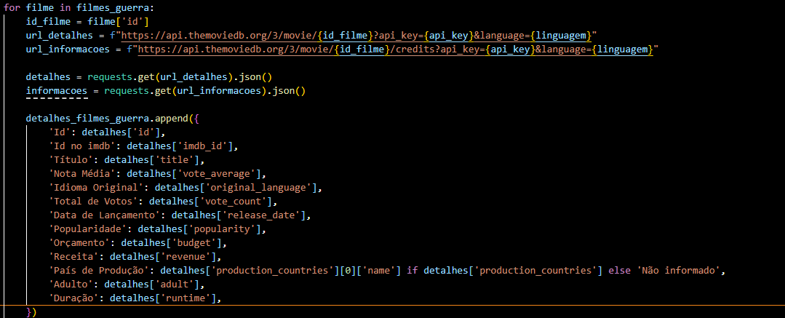
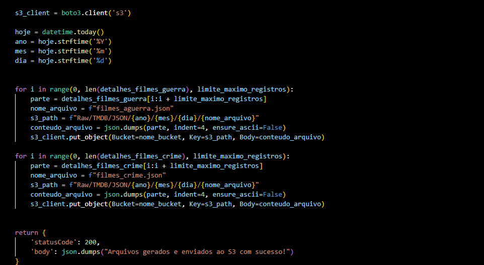
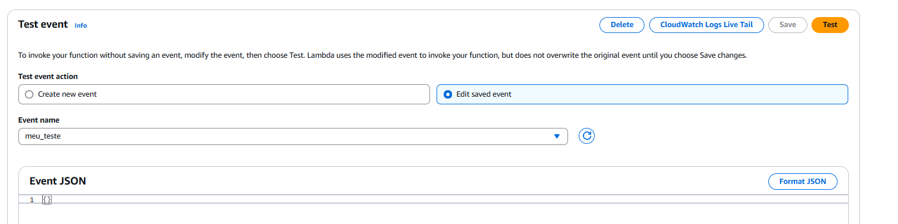
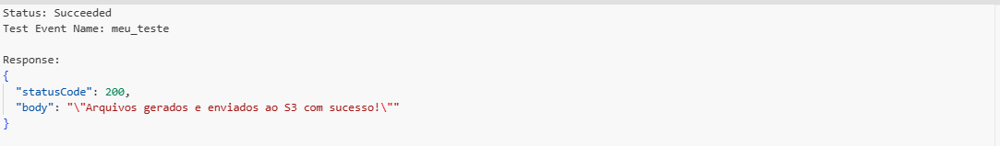

# Desafio Sprint 7

## 📋 **Descrição do desafio e o meu passo a passo**  
Objetivo: Capturar dados do TMDB via AWS Lambda realizando chamadas de API.

## Antes de iniciar o desafio, analisei as informações importantes na documentação. Depois disso, comecei o desafio.

## Primeiramente, criei uma nova camada Layer no AWS Lambda com a biblioteca tmdbv3api para fazer a ingestão de dados utilizando a API do TMDb.

### Comecei baixando o tmdbv3api localmente

### Depois disso, criei uma camada layer no AWS Console a partir dele

### Além disso, criei uma função 

## Por conseguinte, criei um código Python no AWS Lambda que consome os dados do TMDB que complementem minha análise. Agrupei os retornos da API em arquivos JSON com, no máximo, 100 registros cada.

### Meu código começa pela função "Lambda handler", é a partir dela que o restante do código vai ser implementado e executado.

### Configuração inicial:

#### - Obter a chave da API do TMDB de uma variável de ambiente

#### - Definir o nome do Bucket para onde os arquivos vão ser salvos

#### - Limite de registros para arquivos

### IDs de gêneros:

#### - Define os IDs dos gêneros guerra e crime 

### Função "pegar_filmes" 

#### coleta filmes de uma API, página por página

### Requisições à API:

#### - Monta URLs para buscar filmes dos gêneros guerra e crime

#### - Usa as URLs para pegar os filmes das APIs

#### - Cria uma lista vazia de cada Gênero para poder armazenar os filmes

## Continuando o código

## Esse trecho coleta informações detalhadas sobre filmes dos gêneros "crime" e "guerra" através das requisições à API do TMDB 

## Organiza em duas listas separadas, "detalhes_filmes_crime" é referente aos filmes de crime e "detalhes_filmes_guerra" são os de guerra

## Próximo trecho organiza os Dados coletados dos filmes e os envia ao bucket do Amazon S3

### Primeiramente ele pega a data atual para ser usada como caminho no bucket

### Divide os dados dos filmes em partes menores, cada uma com o número máximo de registros definido pela nossa variável "limite_maximo_registros"

### Para cada parte, cria um arquivo JSON com os dados dos filmes

### Define o nome do arquivo e o caminho no S3 como foi pedido no desafio com base na data

### Usa o cliente S3 do boto3 para enviar os arquivos ao bucket, no caminho especificado

### Retorna um código do status "200" indicando que ocorreu tudo certo na execução

## Depois disso criei um test para poder executar o código

## A saida da execução

## Conferindo se os arquivos foram criados no bucket

