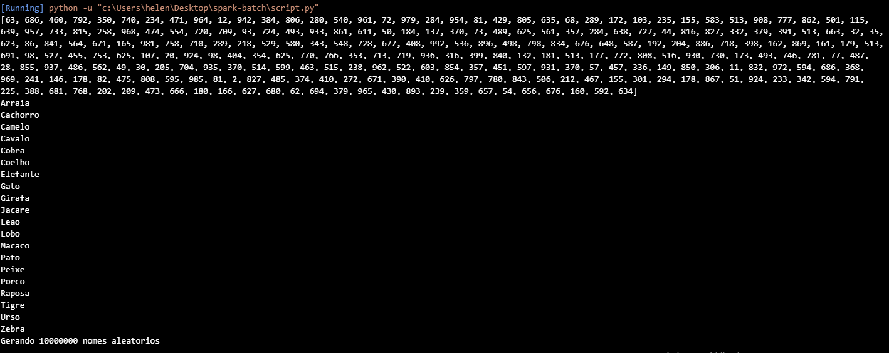
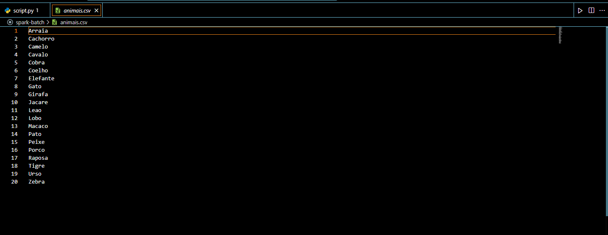
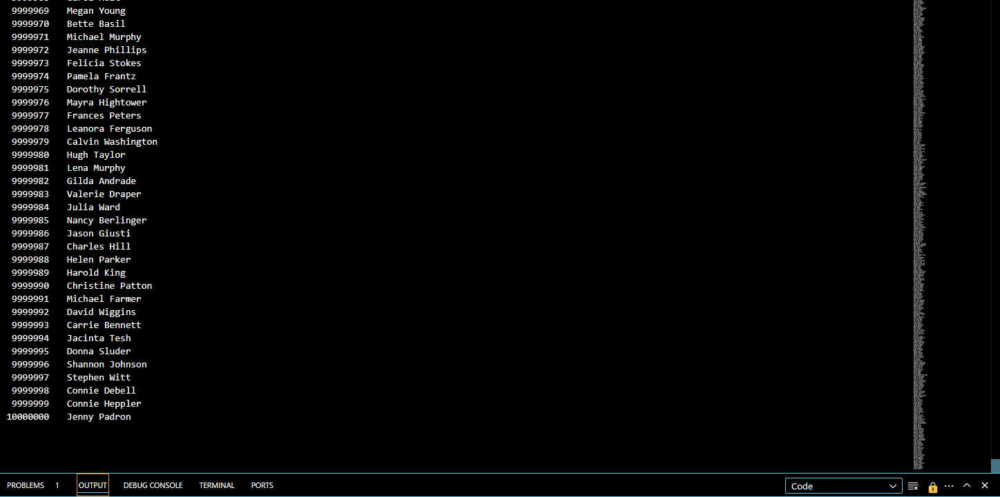
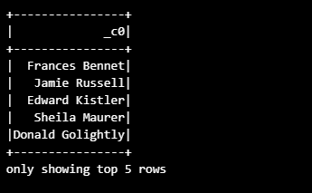
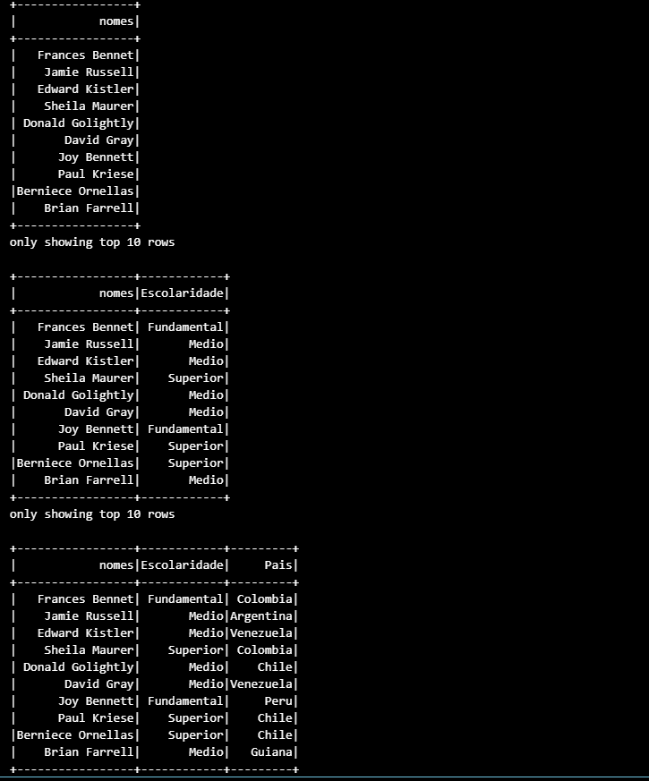
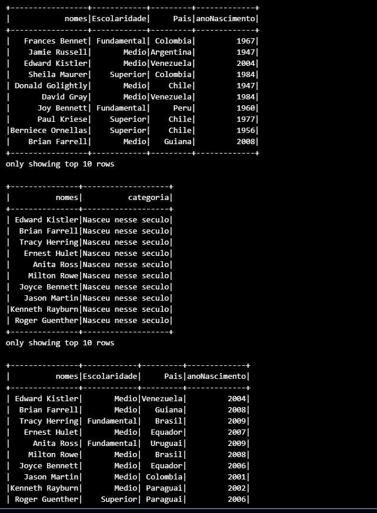
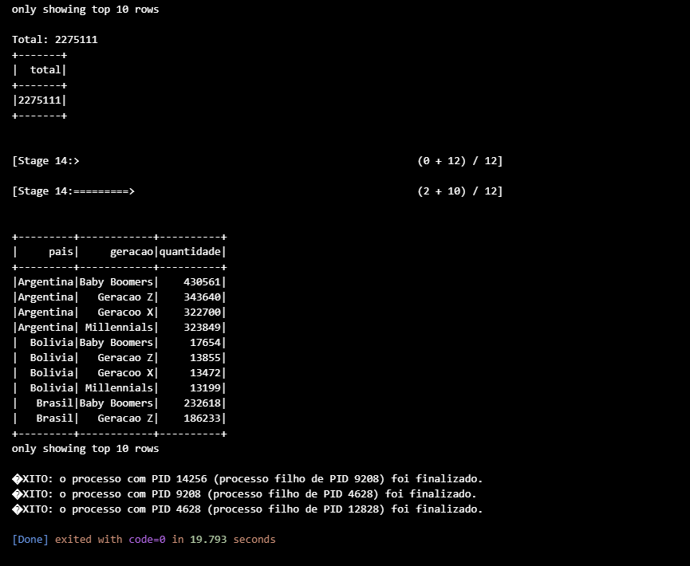
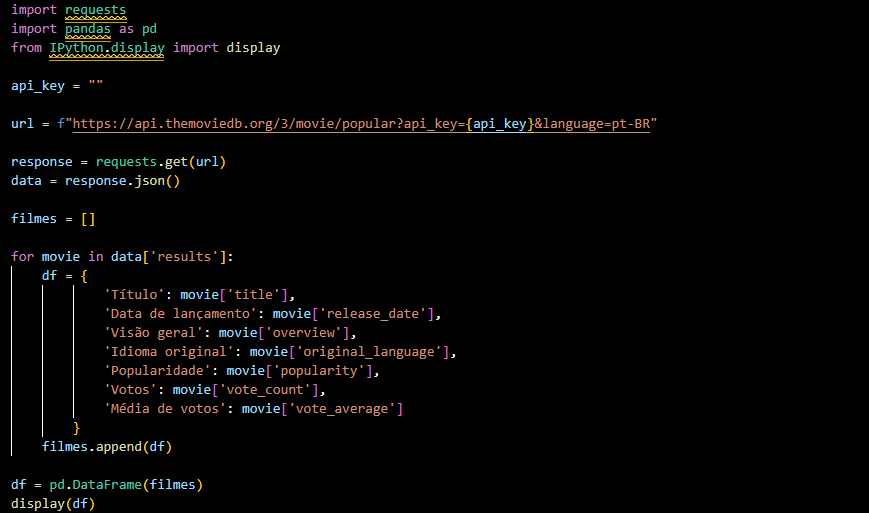
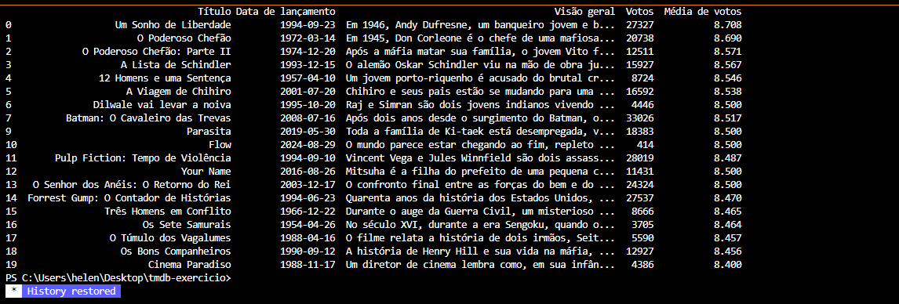

# Exercícios

## No geral, os exercícios foram tranquilos e intuitivos. Aproveitei para explorar o uso do PySpark na manipulação de DataFrames, o que me ajudou a me aprofundar e me familiarizar ainda mais com a sintaxe.
## Logo abaixo, o caminho para a pasta de exercicios

## [Diretorio_exercicios](exercicios/)

# Evidências

## Segue abaixo prints dos exercicios

## Exercicios Spark Batch
 
### Geração e massa de dados:

#### Terminal após a execução do script 

#### Conteúdo do arquivo animais.csv que foi gerado

#### Print das ultimas linhas do arquivo nomes_aleatorios.txt que foi gerado

### Apache Spark:

### Saida da etapa 1

### Saida das etapas 2, 3 e 4

### Saida das etapas 5, 6 e 7

### Saida das etapas 8, 9 e 10

## Exercicio tmdb

### Meu código para buscar os filmes mais populares no tmdb

### Esse foi o resultado gerado a partir do script

# Certificados

## Logo abaixo, o caminho para a pasta de certificados

## [Diretorio_certificados](certificados/)

# Desafio

## Logo abaixo, o caminho para a pasta do desafio

## [Diretorio_desafio](desafio/)