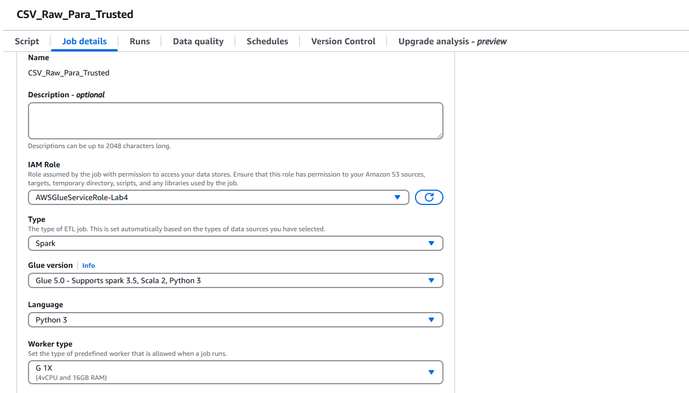
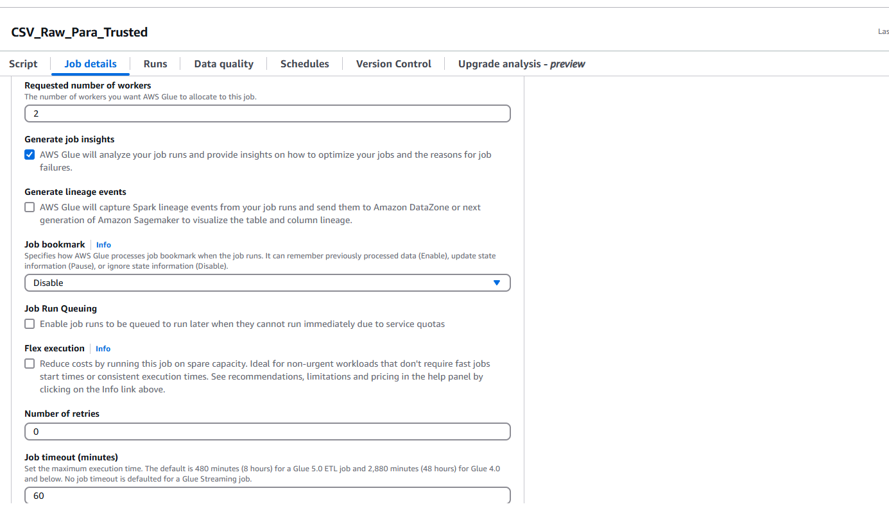
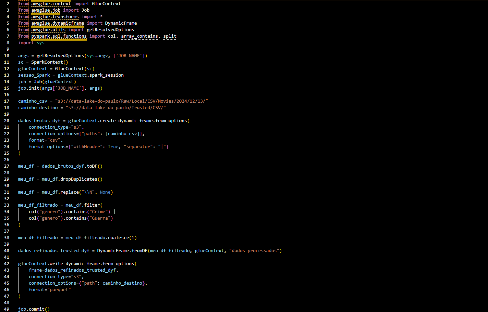
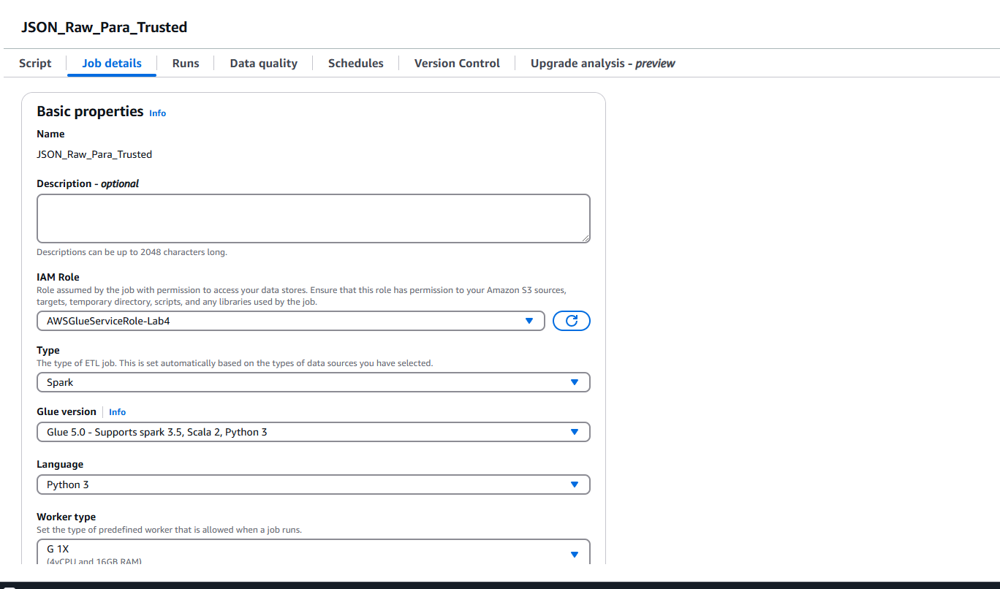
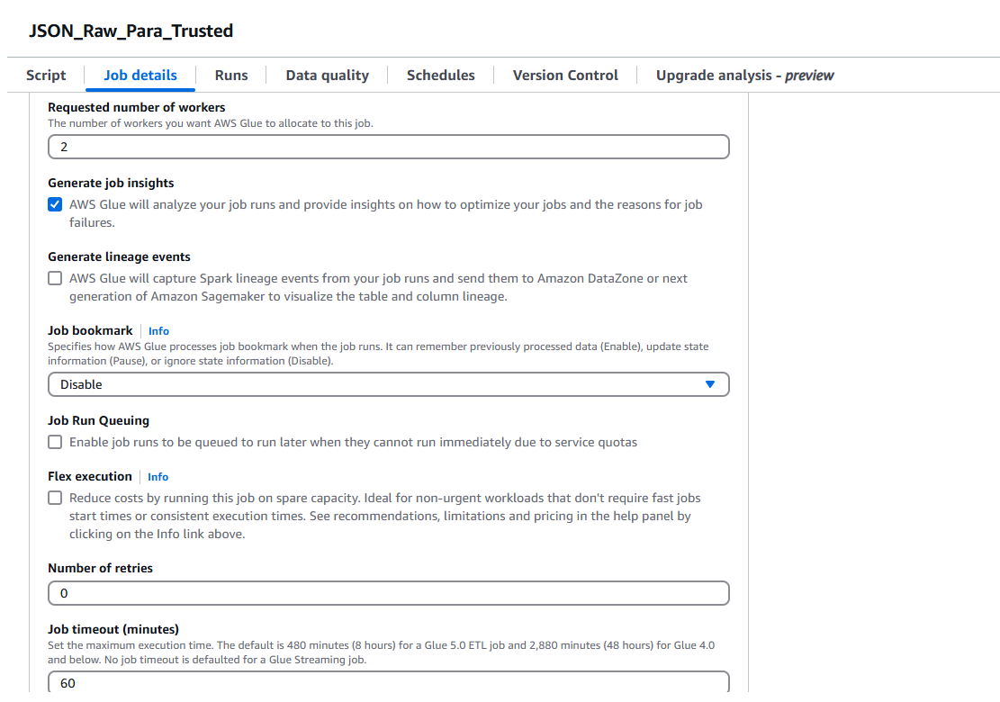
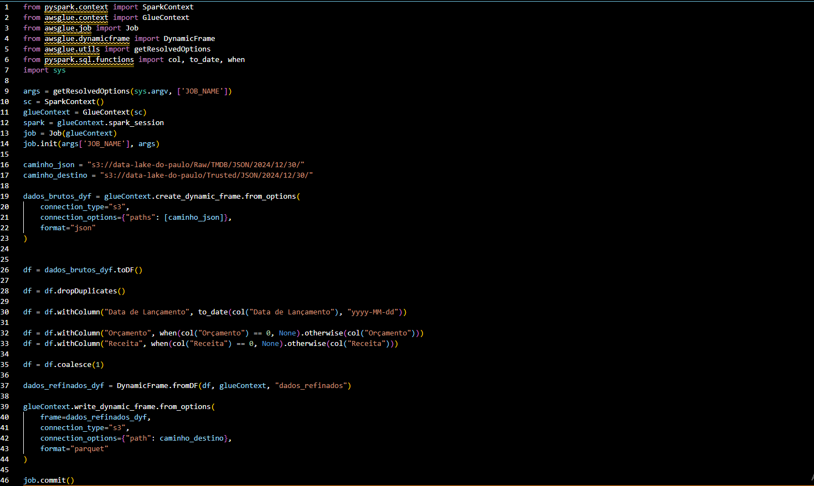
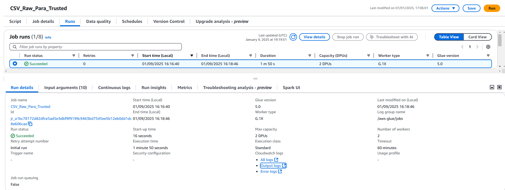
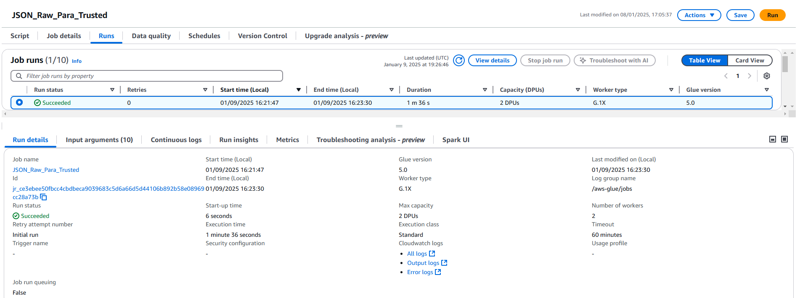
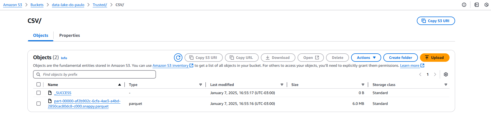
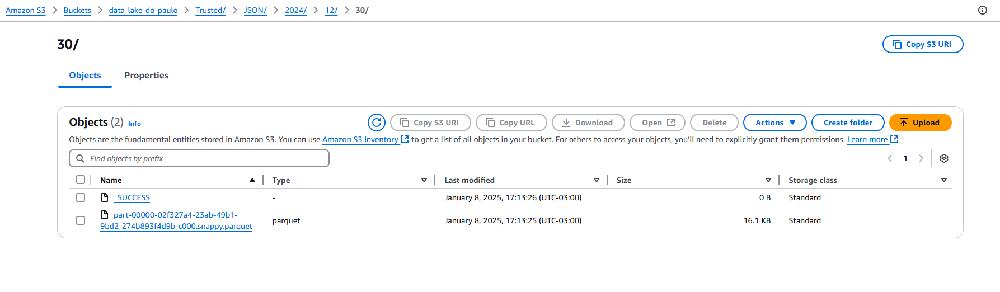

# Desafio Sprint 8

## 📋 **Descrição do desafio e o meu passo a passo**  
Objetivo: Usar o Apache Spark, através do AWS Glue para integrar e padronizar dados existentes na camada Raw Zone para a Trusted Zone. 

## Inicialmente eu comecei criando um job para refinar os dados do CSV, filtrando por critérios específicos e salvando no formato Parquet na camada Trusted

### Logo abaixo estão as configurações desse job, elas foram ajustadas de acordo com o que foi pedido na documentação. Decidi chamar o job de "CSV_Raw_Para_Trusted"

### Logo em seguida construí o meu código no job

### Em resumo ele carrega um arquivo CSV do meu bucket no S3 que está na Raw Zone para um DynamicFrame

### Depois disso converte o DynamicFrame para DataFrame para fazer as seguintes tarefas:

### Remover linhas duplicatas, substituir valores inválidos (\N) por None e filtrar registros cujo campo "gênero" contém "Crime" ou "Guerra"

### Por fim, converte o DataFrame processado de volta para DynamicFrame e grava no formato Parquet no bucket S3 na Trusted Zone

### O script logo abaixo

## Agora um pouco sobre o segundo job que serve para refinar os dados JSON da camada Raw, realizando limpeza e normalização, e salvar no formato Parquet na camada Trusted

### Primeiro, as configurações do job, ele se chama "JSON_Raw_Para_Trusted"

### Agora um pouco sobre o código

### Ele carrega arquivos JSON da camada Raw no S3 em um DynamicFrame

### Depois converte o DynamicFrame em DataFrame para fazer as seguintes funções:

### Remover registros duplicados, converter a coluna "Data de Lançamento" para o formato de data (yyyy-MM-dd) e substituir valores "0" nas colunas "Orçamento" e "Receita" por None

### No final, converte o DataFrame processado de volta para DynamicFrame e salva no formato Parquet na Trusted Zone no S3

### Script com o código abaixo

## Depois de finalizar os jobs, executei ambos

## O arquivo parquet gerado a partir do CSV, na documentação do desafio não pediu particionamento

## Agora o arquivo parquet gerado do JSON, o particionamento de acordo com a data que os dados foram retirados do TMDB como pedido no desafio

