# Desafio Sprint 9

## 📋 **Descrição do desafio e o meu passo a passo**  
Objetivo: Estruturar dados na camada Refined Zone seguindo princípios de modelagem multidimensional, utilizando o AWS Glue Data Catalog para criar tabelas 

## Inicialmente eu comecei criando um job chamado "unir_parquets", que utiliza Apache Spark para processar e transformar dados de duas fontes no formato Parquet, localizadas na camada Trusted do Data Lake, e salvá-los na camada Refined em formato Parquet.

## Resumo do processo:

### Lê dois arquivos de dados Parquet: um local (caminho_local) e outro do TMDb (caminho_tmdb).

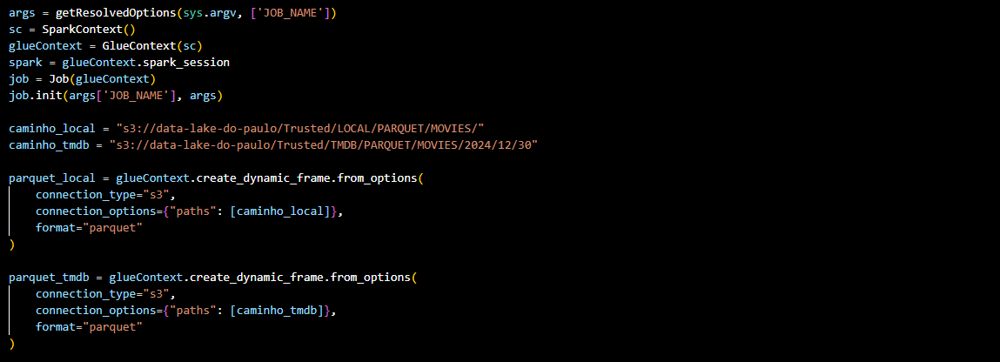

### Realiza um join entre os datasets com base em id_no_imdb e id_local, filtrando apenas registros com orçamento e receita não nulos.

### Calcula o lucro como Receita - Orçamento.

### Cria duas tabelas, uma "Fato" e a "dim_filme"

### Fato: Contém métricas como lucro, receita, orçamento e popularidade.

### Dim_filme: Contém informações sobre os filmes, como título, duração e país de produção.

### Remove duplicados e divide em arquivos otimizados usando coalesce(1).

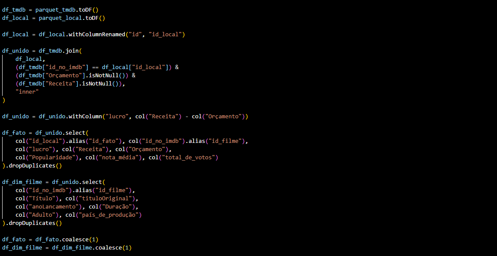

### Salva as tabelas Fato e Dim_Filme no Data Lake na camada Refined no formato parquet, os arquivos particionados por ano, mês e dia.

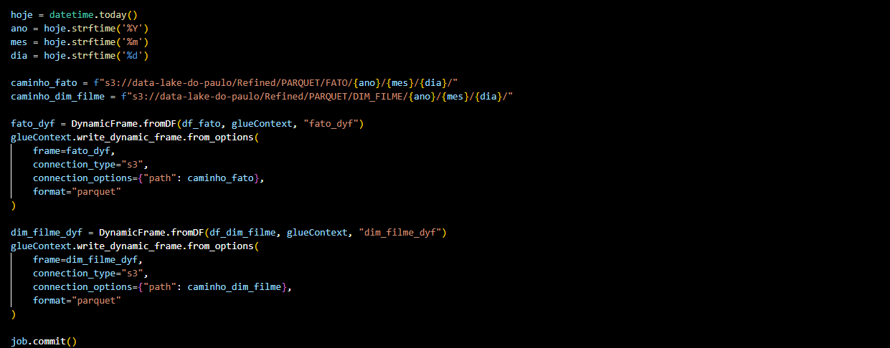

## Agora, o meu diagrama dimensional para facilitar a visualização de como ficou a estrutura das tabelas.

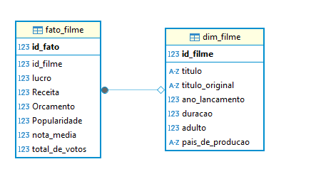

## Execução do meu job, repare nas configurações do mesmo de acordo com a documentação do desafio.

## Arquivo parquet que representa a tabela fato gerado no bucket

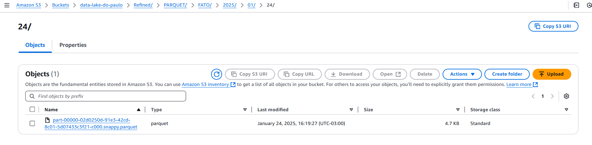

## Arquivo parquet que representa a tabela dim_filme gerado no bucket

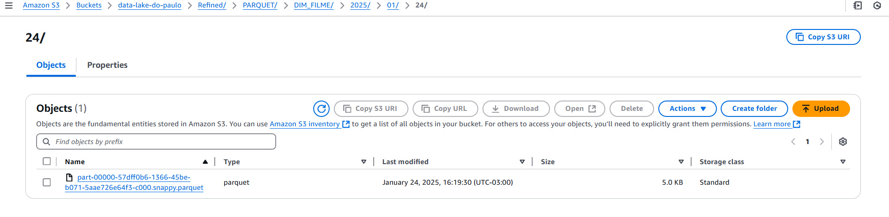

## Depois de executar o job, criei e executei um crawler para a criação das tabelas no aws glue catalog.

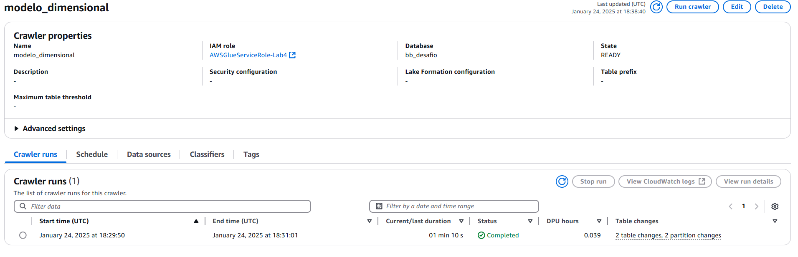

## Resultado com as tabelas criadas a partir do crawler

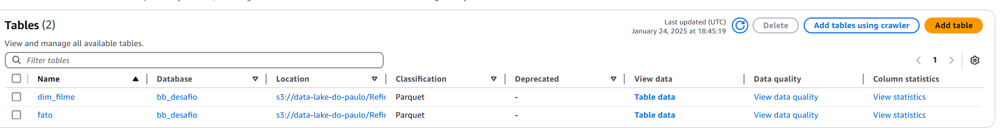

## Depois conferi o conteúdo das tabelas clicando em table data

## Conteúdo da tabela fato:

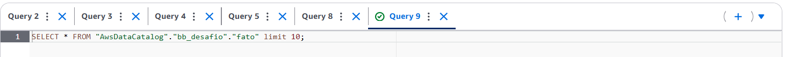

## Conteúdo da tabela Dim_filme:

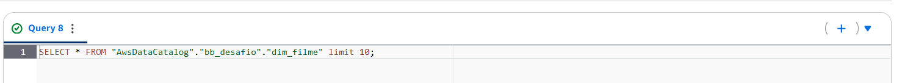

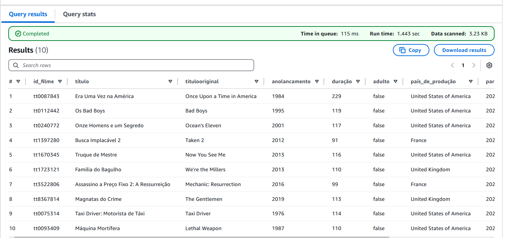
